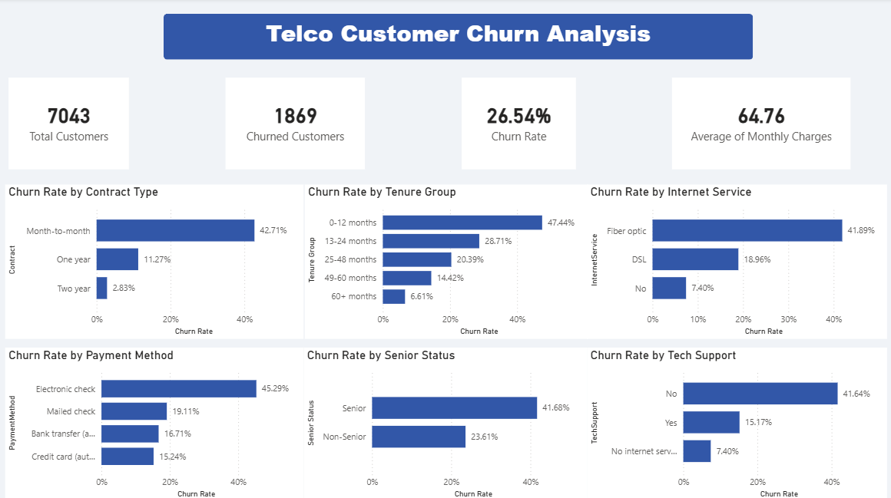

# Telco Customer Churn Analysis
## Overview
Analysis of 7,043 customer records from a fictional telecommunications company using MySQL and Power BI.
The project investigates a 26.54% churn rate — roughly 1 in 4 customers was leaving the business — and identifies the key drivers behind churn across contract types, tenure, internet service, payment methods, and customer demographics.

---

## Author
**Belén Micó Velarde**  
[LinkedIn](https://www.linkedin.com/in/belenmicov)

---

## Tools
- **MySQL** --> data exploration, cleaning, and analysis
- **Power BI** --> interactive dashboard and DAX measures

---

## Dataset
- **Source:** [Telco Customer Churn](https://www.kaggle.com/datasets/blastchar/telco-customer-churn) (Kaggle)
- **Volume:** 7,043 customer records · 21 columns
- **Key columns:** Churn, Contract, Tenure, InternetService, PaymentMethod, MonthlyCharges, TotalCharges, SeniorCitizen, TechSupport

---

## Project Structure
```
telco-customer-churn/
│
├── README.md
├── dashboard_preview.png
├── telco_customer_churn_analysis.sql
└── telco_customer_churn_dashboard.pbix
```

---

## Data Cleaning

Two data quality issues were identified and resolved before analysis:

**1. TotalCharges stored as text with blank strings**  
The column was imported as text and contained empty string values for customers with tenure = 0. These were not detected by a standard NULL check and required a separate query to identify. Blank strings were converted to NULL for correct numerical handling.

**2. Windows carriage return characters in the Churn column**  
All churn-based aggregations initially returned 0. A HEX inspection revealed that each value contained a hidden \r character (0x0D) appended at the end — a byproduct of Windows CSV formatting. REPLACE() was used to clean the column before analysis.

---

## SQL Analysis Structure

**Phase 1 — Data Exploration & Cleaning**  
Verified import integrity, checked for NULLs and blank strings, identified and resolved the carriage return issue, and explored the distribution of key categorical dimensions and tenure groups.

**Phase 2 — Core Churn Analysis**  
Six queries covering overall churn rate, churn by contract type, churn by tenure group, churn by internet service, churn by payment method, and average charges by churn status.

**Phase 2 — Supplementary Analysis**  
Four additional queries covering churn by senior citizen status, churn by tech support subscription, churn by gender, and a high-risk customer profile combining all four primary churn indicators.

---

## Power BI Dashboard Structure

KPI Cards --> Total Customers · Churned Customers · Churn Rate · Avg Monthly Charges  
Core Findings --> Churn by Contract Type · Churn by Tenure Group · Churn by Internet Service  
Supporting Insights --> Churn by Payment Method · Churn by Senior Status · Churn by Tech Support

---

## DAX Measures Created
```
Churn Flag = IF(TRIM(customers[Churn]) = "Yes", 1, 0)
Total Customers = COUNTROWS(customers)
Churned Customers = SUM(customers[Churn Flag])
Churn Rate = DIVIDE([Churned Customers], [Total Customers], 0)
Avg Monthly Charges = AVERAGE(customers[MonthlyCharges])
```

---

## Dashboard Preview
 -->

---

## Key Findings

- **Overall churn rate: 26.54%** — 1,869 out of 7,043 customers left the business.
- **Contract type is the strongest predictor of churn.** Month-to-month customers churn at 42.71% compared to 2.83% for two-year contract customers — a 15x difference.
- **New customers are the most vulnerable segment.** Customers in their first 12 months churn at 47.44%. That rate drops to 6.61% for customers with 60+ months of tenure.
- **Fiber optic customers churn at 41.89%** — more than double the DSL rate of 18.96% — despite paying higher monthly charges, suggesting a price-to-value problem.
- **Electronic check is the highest-risk payment method** at 45.29%, compared to 15-19% for automatic payment methods.
- **Senior citizens churn at 41.68%** versus 23.61% for non-seniors.
- **Customers without tech support churn at 41.64%** compared to 15.17% for those who have it — add-on services reduce cancellation likelihood.
- **Gender shows no meaningful difference** in churn rate (Female: 26.92% · Male: 26.16%).
- **High-risk customer profile:** Customers on a month-to-month contract, in their first 12 months, with fiber optic internet, paying by electronic check churn at **71.16%** — nearly 3x the company average.

---

## Business Recommendations

- **Convert month-to-month customers to longer contracts.** The 15x churn rate difference is the single biggest lever available. Discounts or service upgrades for customers who commit to annual or two-year plans could significantly reduce overall churn.
- **Focus retention efforts on the first 12 months.** With a 47.44% churn rate in year one, early engagement campaigns and onboarding touchpoints are critical.
- **Investigate the fiber optic value proposition.** Fiber customers pay more but leave more. Pricing, service quality, or competitive alternatives may be driving dissatisfaction in this segment.
- **Encourage automatic payment enrollment.** Customers on automatic payment methods churn at 15-16% versus 45% for electronic check users.
- **Promote add-on services as a retention tool.** Customers with tech support churn at less than half the rate of those without it — proactively offering add-ons to new and high-risk customers increases product stickiness.

---

## Notes
This project was built using a synthetic dataset from Kaggle for portfolio purposes. The analytical framework, SQL structure, DAX measures, and dashboard design reflect the approach that would be applied to a real telecommunications dataset to identify churn drivers and inform customer retention strategy.
